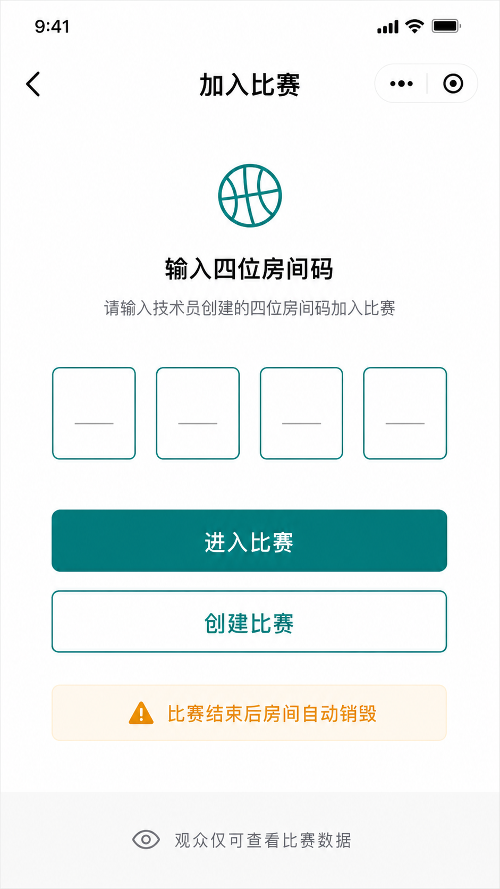
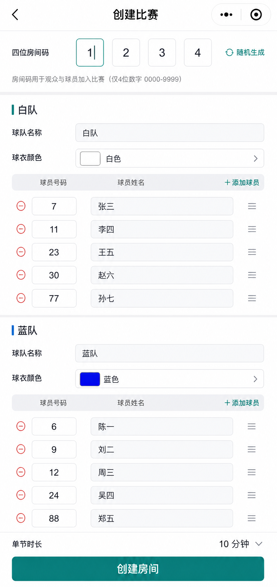
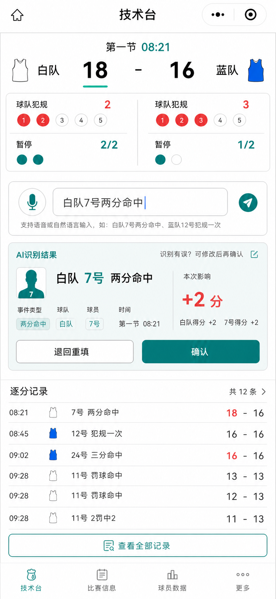
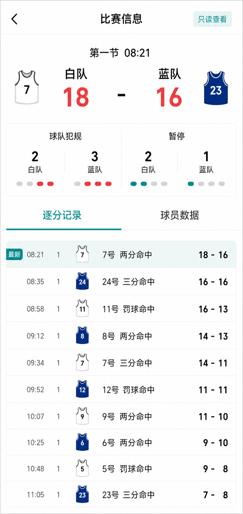
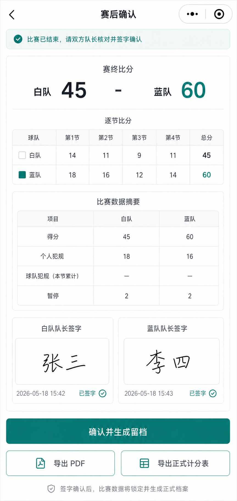

# 篮球技术台自动化

一款为学校班赛、社团赛和训练赛设计的微信小程序：让一名技术员也能完成建赛、计分、规则提醒、观众实时查看、赛后签字和留档导出。

传统篮球技术台依赖纸笔、口头确认和赛后手工整理。这个项目把技术台流程收进手机：比赛开始前设置四位房间码，比赛中用文本或语音快速记录事件，观众用房间码实时看比分，比赛结束后双方队长在设备上签字，系统生成正式计分表、PDF 报告和结构化归档。

## 为什么值得看

- 更轻：不需要专业技术台团队，一名同学就能完成整场比赛记录。
- 更快：语音输入转文字，常见事件确认后直接入账。
- 更稳：比分、犯规、暂停、节次和提醒都由事件流回放生成，减少手算错误。
- 更透明：观众和球员用四位房间码进入同一场比赛，只读查看实时信息。
- 更完整：赛后签字、正式计分表、PDF 报告、结构化数据一次生成，方便复盘和留档。

## 项目亮点

### 从纸质技术台到手机技术台

技术员不再一边听口令、一边翻表格、一边手算比分。小程序把“录入、确认、统计、提醒、同步、导出”串成一条完整流程。

### 文本和语音走同一条确认链路

“白队 7 号两分命中”“蓝队暂停”“比赛结束”这类口语化输入会先变成待确认事件，技术员确认后才正式生效。语音只是更快的输入方式，不会绕过人工确认。

### 观众天然有参与感

观众不需要注册、不需要链接，只输入四位房间码，就能看到实时比分、节次、犯规和暂停信息。比赛数据与技术台同源，不会出现观众端和记录端不一致。

### 赛后不再重新整理

比赛结束后，双方队长完成电子签字，系统自动生成归档版本。正式计分表 HTML、PDF 报告和结构化 JSON 都绑定同一份事件流，方便主办方复核。

## 核心流程

1. 技术员创建比赛：设置房间码、队伍、球衣颜色、球员名单和单节时长。
2. 观众加入比赛：输入四位房间码进入只读比赛页。
3. 比赛中记录：文本或语音输入事件，确认后更新比分和规则提醒。
4. 实时同步：技术台确认后，观众页同步刷新。
5. 赛后签字：双方队长在设备上签字。
6. 一键归档：生成正式计分表、PDF 报告和结构化数据。

## 界面预览

| 加入比赛 | 创建比赛 | 技术台 |
| --- | --- | --- |
|  |  |  |

| 比赛信息 | 赛后确认 |
| --- | --- |
|  |  |

## 当前完成度

首版目标已经跑通：

- 微信小程序工程和云开发环境接线
- 创建比赛、加入房间、技术台录入、观众只读页
- 得分、犯规、暂停、计时、节次、规则提醒
- 文本输入与语音输入
- 云数据库实时同步
- 双方队长签字
- 正式计分表 HTML、PDF 报告、结构化 JSON 归档
- 权限隔离：技术员写入，观众只读

## 评委快速查看

代码主目录在 [`coding区`](coding区/)。

```powershell
cd coding区
npm install
npm run typecheck
npm test
npm run build:miniprogram
```

微信开发者工具打开 [`coding区`](coding区/) 即可查看小程序工程。敏感凭据没有写入仓库，云函数私有环境变量由云端保存。

## 相关文档

- [产品文档](技术台自动化_产品文档模板_v0.4.html)
- [页面流程与交互原型](页面流程与交互原型说明_v0.1.html)
- [技术实现方案与开发任务拆解](技术实现方案与开发任务拆解_v0.1.html)
- [事件字典与自然语言输入规范](事件字典与自然语言输入规范_v0.1.html)

## 一句话

篮球技术台自动化不是把纸质表格搬进手机，而是把一场班赛从开赛、记录、观看到签字归档的完整闭环变成一个低门槛、可复核、可分享的小程序体验。
