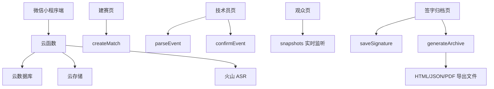

# 篮球技术台自动化

## 项目简介

篮球技术台自动化是一款微信小程序原型，面向校园赛、社区赛、企业赛等基层篮球比赛。它用自然语言输入替代手工统计表录入，把比赛技术台从“纸笔记录 + 口头同步 + 赛后人工整理”升级为“实时记录 + 实时查看 + 赛后自动归档”。

## 真实痛点

基层篮球比赛中，技术台通常面临以下问题：

- 记录人员不专业，比分、犯规、暂停容易漏记或记错。
- 观众和参赛队需要不断询问比分，技术台被打断。
- 比赛结束后要补整理纸质表、签字、归档，耗时且容易遗漏。
- 纸质记录不便于复盘和长期保存。

本项目的解决思路是：技术员只需要输入类似“白队 7 号两分命中”的自然语言，系统自动解析、二次确认、写入正式事件流，并实时更新比分和赛后报告。

## 核心功能

1. 建赛与房间码
   - 创建比赛，设置主客队、球衣颜色、球员名单。
   - 使用四位房间码加入比赛。
   - 不存在房间时显示业务提示“未找到比赛房间。”。

2. 技术员自然语言录入
   - 支持得分、罚球组、个人犯规、球队暂停、计时开始/暂停/继续、时间更正、节次结束、比赛结束。
   - 解析后先生成待确认事件，确认后才写入正式事件流。

3. 规则引擎
   - 自动回放正式事件流，计算总比分、逐节比分、个人得分、个人犯规、球队本节犯规、暂停额度。
   - 支持个人 5 犯提醒、球队第 5 犯提醒、最后 1 分钟提醒。

4. 观众只读页
   - 观众输入房间码后进入只读比分页。
   - 先读取当前快照，再开启实时监听，避免空态。

5. 赛后签字与归档
   - 支持双方队长签字。
   - 生成归档版本。
   - 导出正式计分表 HTML、结构化 JSON 和中文 PDF 报告。
   - PDF 报告包含球队得分、逐节比分、球员个人得分与犯规。

6. 语音能力预留
   - 已完成火山引擎 ASR 云函数接线。
   - 当前验收主线先以自然语言文本输入为主，语音作为后续增强项。

## 技术架构



## 目录结构

```text
coding区/
  miniprogram/        微信小程序页面、领域逻辑、云服务调用
  cloudfunctions/     云函数：建赛、解析、确认、签字、归档、ASR
  tests/              本地确定性测试
  package.json        类型检查、测试、小程序 TS 构建脚本
```

## 关键云函数

| 云函数 | 作用 |
|---|---|
| `createMatch` | 创建比赛、房间、初始快照 |
| `parseEvent` | 自然语言文本解析为待确认事件 |
| `confirmEvent` | 确认事件、写入正式事件流、重算快照 |
| `transcribeAudio` | 语音文件转写，当前作为增强项 |
| `saveSignature` | 保存双方队长签字 |
| `generateArchive` | 生成 HTML、JSON、中文 PDF 报告 |
| `getArchiveStatus` | 恢复已签字和导出文件临时链接 |

## 运行方式

```powershell
cd E:\篮球计分统计vibecoding项目\coding区
npm install
npm run build:miniprogram
npm run typecheck
npm test
```

然后使用微信开发者工具打开 `coding区`。

## 云开发配置

- 小程序 AppID：已写入 `project.config.json`。
- 云开发环境：已初始化并部署云函数。
- 敏感凭据：ASR 的 access token / secret key 不写入前端源码，只通过云函数环境变量读取。

## 验证结果

- `npm run typecheck`：通过。
- `npm run build:miniprogram`：通过。
- `npm test`：通过，21 个测试用例。
- 完整自然语言比赛自动化：通过。
- 赛后归档：HTML / JSON / 中文 PDF 均生成成功。

## 演示建议

演示视频控制在 3 分钟以内，按以下顺序展示：

1. 说明基层篮球技术台痛点。
2. 创建比赛并添加球员。
3. 观众用房间码加入。
4. 技术员输入自然语言事件并确认。
5. 展示比分、犯规、暂停变化。
6. 输入比赛结束。
7. 双方签字并生成归档。
8. 打开中文 PDF 报告，展示球队得分和球员个人得分。
