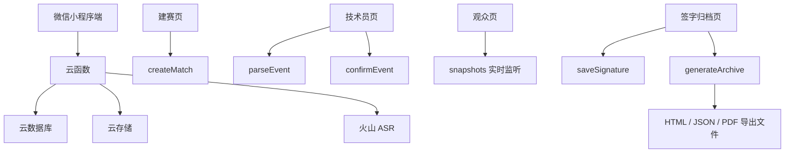

# 篮球技术台自动化 - 黑客松最终提交

队伍：i坤队  
形式：solo  
GitHub 仓库：https://github.com/INTERPUT/basketball-scorekeeper-miniapp

## 一句话介绍

篮球技术台自动化是一款面向校园篮球爱好者比赛的微信小程序，用四位房间码连接技术员和观众，通过自然语言录入比赛事件，自动完成比分、犯规、暂停、计时提醒、赛后签字和归档报告生成。

## 提交材料总览

| 提交要求 | 当前材料 | 验证状态 |
|---|---|---|
| GitHub 仓库（代码公开 + 可运行） | https://github.com/INTERPUT/basketball-scorekeeper-miniapp | 已验证公开仓库，`main` 最新提交为 `7f2feba` |
| 3 分钟以内演示视频 | `黑客松参赛区/最终提交材料/篮球技术台自动化_三分钟演示视频.mp4` | 已验证 2 分 31 秒，1920x1080，H.264 MP4，AAC 中文旁白 |
| Prompt 记录文档 | `黑客松参赛区/最终提交材料/02_Prompt记录_VibeCoding过程.md` | 已整理需求、实现、测试、Debug 和 Vibe Coding 过程 |
| 项目 README | `README.md` | 已覆盖痛点、新增功能说明、核心流程、运行方式和验证结果 |
| 多维表格最终进度截图 | `黑客松参赛区/最终提交材料/最终进度多维表格截图.png` | 文件存在，已作为最终进度截图材料 |

## 项目痛点

专业篮球计分设施价格高、链路复杂，更适合较大型或正式赛事。校园和社团比赛通常只能依赖翻分牌、纸质记录表和临时技术台：观众远处看分困难，技术员要在比分、犯规、暂停、计时之间来回切换，纸质统计表也有阅读和填写门槛。

现有按钮式计分小程序虽然比纸笔更轻，但得分、犯规、暂停等指标分散，临场仍然需要找按钮、切模块，也缺少暂停、时间和犯规临界提醒。

## 解决方案

本项目把技术台流程收进微信小程序：

1. 技术员创建比赛，设置四位房间码、主客队和球员。
2. 观众输入房间码进入只读比分页。
3. 技术员用自然语言输入比赛事件，例如“白队 7 号两分命中”。
4. 系统解析为待确认事件，确认后写入正式事件流。
5. 事件流自动回放生成比分、逐节比分、球员个人得分、犯规、暂停和规则提醒。
6. 比赛结束后双方队长签字，系统生成 HTML 计分表、结构化 JSON 和中文 PDF 报告。

首版目标是把校园比赛常见的“两人计分互校 + 一人计时翻分”压缩为一名技术员完成。

## 核心新增功能

- 自然语言技术台：支持得分、罚球、个人犯规、暂停、计时、节次和比赛结束。
- 待确认机制：解析结果先确认，再入账，避免误识别直接改分。
- 实时观众页：观众通过四位房间码查看只读比分，不干扰技术员。
- 规则提醒：个人 5 犯、球队第 5 犯、暂停额度和最后 1 分钟提醒。
- 球员添加弹窗：球衣号码和姓名分开录入，避免名单格式错误。
- 赛后签字归档：双方队长电子签字，生成正式计分表、JSON 和中文 PDF。
- 中文 PDF 报告：除球队得分外，加入球员个人得分和犯规统计。

## 技术架构



## 运行方式

```powershell
cd E:\篮球计分统计vibecoding项目\coding区
npm install
npm run build:miniprogram
npm run typecheck
npm test
```

然后使用微信开发者工具打开 `coding区`。小程序 AppID 已写入 `project.config.json`，云开发环境和云函数已完成首版接线。敏感凭据不写入前端源码，ASR 凭据通过云函数环境变量读取。

## 当前验证结果

- GitHub 公开仓库：`private=false`，默认分支 `main`。
- 远端最新提交：`7f2feba`。
- `npm run build:miniprogram`：通过。
- `npm run typecheck`：通过。
- `npm test`：通过，6 个测试文件、21 个测试用例。
- 演示视频：2 分 31 秒，低于 3 分钟。
- 完整自然语言比赛测试：覆盖 4 节、19 条自然语言事件。
- 最终比分：白队 8 : 6 蓝队。
- 归档导出：HTML、JSON、中文 PDF 均生成成功。
- PDF 报告：包含球队得分、逐节比分、球员个人得分和犯规统计。

## 演示视频内容

视频文件：`篮球技术台自动化_三分钟演示视频.mp4`

视频覆盖：

1. 专业计分设施贵且复杂。
2. 基层比赛依赖翻分牌和纸质记录表。
3. 按钮式计分仍要找按钮、切模块。
4. 建赛与添加球员。
5. 自然语言录入和待确认事件。
6. 一名技术员完成比分、犯规、暂停和提醒。
7. 完整测试结果。
8. 中文 PDF 报告展示球队得分和球员个人得分。
9. GitHub 仓库和工程验证。

## Vibe Coding 过程摘要

本项目以四份需求文档作为唯一需求基线，按“阶段 0 / 阶段 1 / 阶段 2 / 阶段 3”推进：

- 阶段 0：阅读需求、梳理技术方案、建立 `PROJECT_STATUS.md` 状态文件。
- 阶段 1：完成领域模型、事件字典、自然语言解析和本地测试。
- 阶段 2：接入微信小程序页面、云函数、云数据库、实时监听和归档导出。
- 阶段 3：完成完整自然语言比赛测试，修复房间不存在提示、球员添加方式、中文 PDF 报告和个人得分输出。
- 提交阶段：整理 README、Prompt 记录、三阶段文档、演示脚本、HTML-PPT、演示视频和进度截图。

关键 Prompt 和调试记录详见：`02_Prompt记录_VibeCoding过程.md`。

## 最终提交链接与附件

- GitHub 仓库：https://github.com/INTERPUT/basketball-scorekeeper-miniapp
- 演示视频：`篮球技术台自动化_三分钟演示视频.mp4`
- README：`README.md`
- Prompt 记录：`02_Prompt记录_VibeCoding过程.md`
- 三阶段进度文档：`黑客松每日进度_三阶段填写版.docx`
- 多维表格最终进度截图：`最终进度多维表格截图.png`
- HTML-PPT：`篮球技术台自动化_黑客松演示.html`
